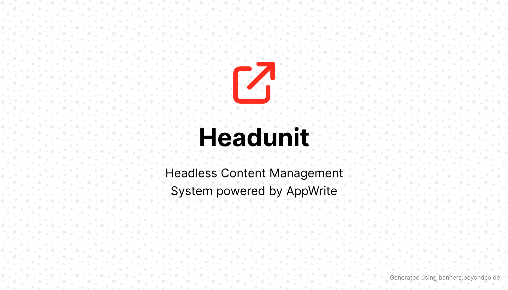

<div align="center">
    <strong>Headless Content Management System powered by AppWrite</strong>
</div>


A Headless CMS powered by [Next.js](https://nextjs.org/), [Tailwind CSS](https://tailwindcss.com), Typescript, and [AppWrite](https://appwrite.io/).
Pre-configured with absolute import, [TailwindUI](https://tailwindui.com), [Framer Motion](https://www.framer.com/motion/), and some additional components.

## Quick Installation

```bash
# Using Yarn is recomended
npx create-next-app mywebsite -e "https://github.com/riipandi/headunit"

# If you want to use npm instead
npx create-next-app mywebsite --use-npm -e "https://github.com/riipandi/headunit"
```

> Don't forget to change `mywebsite` with your real application name.

## Quick Start

### Using NPM

```bash
npm install     # install dependencies
npm run dev     # serve with hot reload at localhost:3000
npm run build   # build for production
npm run start   # launch generated build
```

### Using Yarn

```bash
yarn         # install dependencies
yarn dev     # serve with hot reload at localhost:3000
yarn build   # build for production
yarn start   # launch generated build
```

> For detailed explanation on how things work, check out [Next.js docs](https://nextjs.org).

## Deploy your own

You'll want to fork this repository and deploy your own Next.js website. You can do a one-click
deploy with the button below.

[](https://vercel.com/new/git/external?repository-url=https%3A%2F%2Fgithub.com%2Friipandi%2Fheadunit)

Once you have an image generator that sparks joy, you can setup [automatic GitHub](https://vercel.com/github) 
deployments so that pushing to master will deploy to production! 🚀

## License

MIT: [https://aris.mit-license.org/](https://aris.mit-license.org/)
